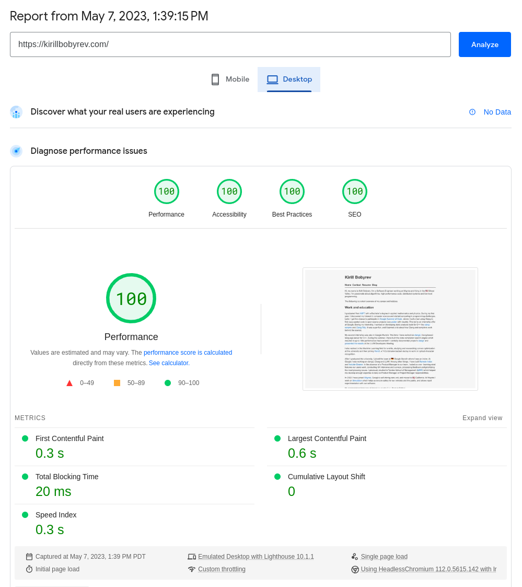

# minimis

Minimalistic theme for personal websites built with [Hugo](https://gohugo.io).
The goal of minimis is to be:

- Small, so that the codebase is very easy to understand and easily
  understandable
- Focused to avoid feature bloat. The goal is to build a theme for a personal
  page and software engineering blog.
- Simple: no complicated and large CSS frameworks, JavaScript libraries and
  heavy dependencies.

This theme is heavily inspired by [bearblog](https://bearblog.dev/) and
[hugo-bearblog](https://github.com/janraasch/hugo-bearblog), but is focused on
features that I was missing and wanted to change/adjust to my liking. bearblog
is a prime example of something that looks very good with minimal CSS
configuration, so I realized there is no need to use a complicated framework if
I want it to look good. I'm also not an expert in UI and front-end Web
development, so I avoid complicated things.

## [Live demo](https://kirillbobyrev.com) and [source code](https://github.com/kirillbobyrev/kirillbobyrev.com)

I use this theme to power my personal website and it serves as the live demo +
example website (check GitHub
[repository](https://github.com/kirillbobyrev/kirillbobyrev.com)). It also has
the GitHub Actions-based workflow for automatic deployment to GitHub Pages with
a custom domain. The goal of minimis is to let the Hugo site (user) focus on the
content, so there is no configuration there, only the content and GitHub Pages
integration.

## Features

- Tags and filtering
- Custom links in the main menu
- Google Analytics, Twitter cards
- RSS
- Favicons
- Math rendering with KaTeX
- Diagram rendering with Mermaid.js
- Mastodon verification

## Example site

In order to build the example site and test your changes, run

```shell
$ hugo server --source exampleSite
Start building sites …
hugo v0.111.3+extended darwin/arm64 BuildDate=unknown

                   | EN
-------------------+-----
  Pages            | 40
  Paginator pages  |  0
  Non-page files   |  0
  Static files     | 12
  Processed images |  0
  Aliases          |  0
  Sitemaps         |  1
  Cleaned          |  0

Built in 23 ms
```

## Performance

Because of no additional JavaScript/CSS frameworks loading, the performance of
Minimis is really good and scores highly on PageSpeed Insights:

[](https://pagespeed.web.dev/analysis/https-kirillbobyrev-com/3rs7dkc9x6?form_factor=desktop)
