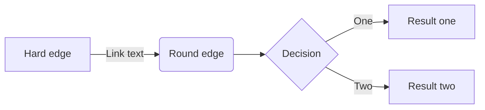

+++
title = "Extensions"
date = 2023-05-08
tags = ["hugo", "features"]
math = true
+++

Use `` [Hugo
shortcode](https://gohugo.io/content-management/shortcodes/) to generate table
of contents:



## Checklist

- [ ] TODO
- [x] Completed

## Code highlighting

Use highlight
[shortcode](https://gohugo.io/content-management/syntax-highlighting/#example-highlight-shortcode)
or Markdown-style code fences with attributes to highlight regions, set line
numbers etc.

````markdown
go {linenos=inline,hl_lines=[8,"15-17"],linenostart=199}
````

```go {linenos=inline,hl_lines=[8,"15-17"],linenostart=199}
// GetTitleFunc returns a func that can be used to transform a string to
// title case.
//
// The supported styles are
//
// - "Go" (strings.Title)
// - "AP" (see https://www.apstylebook.com/)
// - "Chicago" (see https://www.chicagomanualofstyle.org/home.html)
//
// If an unknown or empty style is provided, AP style is what you get.
func GetTitleFunc(style string) func(s string) string {
  switch strings.ToLower(style) {
  case "go":
    return strings.Title
  case "chicago":
    return transform.NewTitleConverter(transform.ChicagoStyle)
  default:
    return transform.NewTitleConverter(transform.APStyle)
  }
}
```

## Math

$$
i \hbar \frac{\partial}{\partial t}\Psi(\mathbf{r},t) = \hat H \Psi(\mathbf{r},t)
$$

## Emoji

In addition to the :us:

## Gist



## YouTube



## Mermaid diagrams


